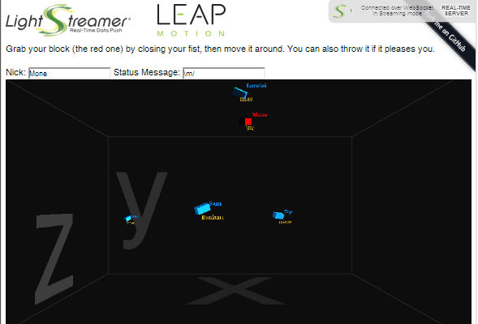

# Lightstreamer - Leap Motion Demo - HTML (LeapJS, Three.js) Client

<!-- START DESCRIPTION lightstreamer-example-leapmotion-client-javascript -->
The *Leap Motion Demo* is a simple application showing the integration between a [Leap Motion Controller](https://www.leapmotion.com/) and the [Lightstreamer JavaScript Client library](https://lightstreamer.com/api/ls-web-client/latest/index.html).
It displays a game field containing some small blocks, where each block is controlled by a different user connected to the same application through a Leap Motion Controller device. 

This project includes a web client front-end for the *Leap Motion Demo*:

As an example of [Lightstreamer Adapters Needed by This Client](https://github.com/Lightstreamer/Lightstreamer-example-LeapMotion-client-javascript#lightstreamer-adapters-needed-by-this-client), you may refer to the [Lightstreamer - Leap Motion Demo - Java Adapter](https://github.com/Lightstreamer/Lightstreamer-example-LeapMotion-adapter-java).

## Live Demo

### [ View live demo](https://demos.lightstreamer.com/LeapDemo/)

## Details

This page uses the *JavaScript Client API for Lightstreamer* to handle the communications with Lightstreamer Server, *leapjs* to read the users' hand movement through the Leap Motion Controller and
*three.js* to display the users' positions on the browser.

Each user can act on its own block in two different modes: he can make a fist to grab its block and drag it around the game field, or release the fist and "throw" his block.
In the first case, all the hand positions are sent to the Lightstreamer server, which, in turn, push them to all the currently connected clients, whereas in the latter case, only 
the applied forces are sent to the server and to the other clients; each client will calculate the current position of the block using the received forces and will re-synchronize 
with the Lightstreamer server, which is calculating the various positions, too, every few seconds. 

<!-- END DESCRIPTION lightstreamer-example-leapmotion-client-javascript -->

## Install
If you want to install a version of this demo pointing to your local Lightstreamer server, follow these steps:
* As prerequisite, the [Lightstreamer - Leap Motion Demo - Java Adapter](https://github.com/Lightstreamer/Lightstreamer-example-LeapMotion-adapter-java) has to be deployed in your local Lightstreamer server instance. Please check out that project and follow the installation instructions provided with it.
* Get the `lightstreamer.js` file from [Lightstreamer distribution](http://www.lightstreamer.com/download/#ls70) (see compatibility notes below) and put it in the `src` folder of the demo.
The version required by this demo can be found in Lightstreamer version 5.1.2 to 7.0.
* RequireJS is currently hot-linked in the html page: you may want to replace it with a local version and/or to upgrade its version.
* jQuery is currently hot-linked in the html page: you may want to replace it with a local version and/or to upgrade its version.
* leapjs is currently hot-linked in the html page (look for 0.3.0-beta2/leap.js), but you may need to replace it with a local version.
You can find the version currently used in the demo [on Github](https://github.com/leapmotion/leapjs/blob/v0.3.0-beta2/leap.js), where newer versions are also available.
* three.js is currently hot-linked in the html page: you may want to replace it with a local version and/or to upgrade its version.
* Deploy this demo on the Lightstreamer Server (used as Web server) or in any external Web Server. If you choose the former, please create the folder `<LS_HOME>/pages/LeapDemo` and copy here the contents of the `/src` folder of this project.
The client demo configuration assumes that Lightstreamer Server, Lightstreamer Adapters, and this client are launched on the same machine. If you need to target a different Lightstreamer server, please search in `js/Constants.js` this line:  `SERVER: protocolToUse+"//localhost:8080"`  and change it accordingly.
* Open your browser and point it to: [http://localhost:8080/LeapDemo/](http://localhost:8080/LeapDemo/)

## See Also

### Lightstreamer Adapters Needed by This Client ##
<!-- START RELATED_ENTRIES -->

* [Lightstreamer - Leap Motion Demo - Java Adapter](https://github.com/Lightstreamer/Lightstreamer-example-LeapMotion-adapter-java)

<!-- END RELATED_ENTRIES -->

## Lightstreamer Compatibility Notes

* Compatible with Lightstreamer JavaScript Client library version 6.1 to 7.x.
